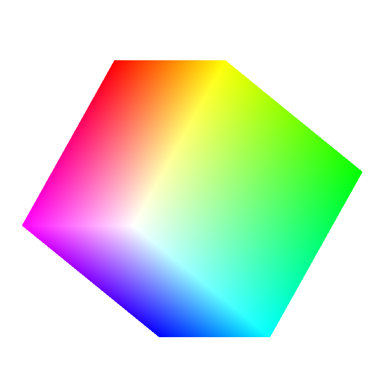

## Learn to create arbitrary transformation matrices from simple transformations

1. Gasket3D

2. Cubev
  
  
  1. Callback function used to control object rotation
   
  ```cpp
    void mouse_button_callback(GLFWwindow *window, int button, int action, int mods)
  {
    if (action == GLFW_PRESS)
    {
      switch (button)
      {
      case GLFW_MOUSE_BUTTON_LEFT: //左键按下
        axis = xAxis;
        break;
      case GLFW_MOUSE_BUTTON_MIDDLE: //中健按下
        axis = yAxis;
        break;
      case GLFW_MOUSE_BUTTON_RIGHT: //右键按下
        axis = zAxis;
        break;
      default:
        break;
      }
    }
  }
  ```

