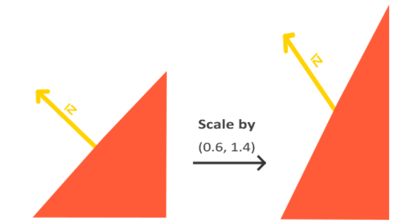

# <center/>计算机图形学报告


##### 二、研讨内容
1. 实验1
   1. 实验要求
      1. 实现并讨论用OpenGL编写基本的二维图形显示程序的程序结构和书写规范
      2. 绘制一个组合对象，比如一个卡通人物
   2. 实验步骤
      1. 本实验基于```小猪佩奇```的特殊形象，通过使用椭圆，圆，三角形。
      2. 创建渲染循环以不断绘制图形。使用OpenGL命令绘制基本图形。 组合不同图形创造复合图形
      3. 解决图形叠加次序问题，调整图形的旋转角度。
   3. 实验结果
   
   4. 实验的思考
      1. 遮挡关系的选择
         1. 改变函数执行的先后顺序
      2. 旋转角度的设置以及图形位置
         1. 使用geogebra，第三方库。
      3. 如何绘制椭圆、圆
         1. 用for循环用sin、cos绘制点。点的坐标由圆/椭圆的方程得到
         2. 椭圆：改变sin，cos前的系数
   5. 实验贡献
      1. 本实验除了ppt外，都是由我一人完成。
   6. 优点
      1. 对象由圆和多边形构成，包含不同种类的多边形
      2. 对象至少有两种颜色，由图可见，颜色丰富。
2. 实验2
   1. 实验要求
      1. 绘制三维简单模型，比如球、四面体、立方体、圆柱等，并合理封装
      2. 应用变换进行模型组装
   2. 实验步骤
      1. 设置一个球体的顶点、索引和颜色
         1. 通过两个嵌套的循环生成球体的顶点。这些坐标被添加到名为sphereVertices3的顶点数组中
         2. 两个嵌套的循环，生成球体的索引。根据当前顶点的位置，计算球体表面上两个三角形的索引，并将它们添加到sphereIndices3数组中。这些索引用于定义绘制球体的三角形面
         3. 使用两个嵌套的循环为每个顶点设置颜色，将颜色向量添加到sphereColors3数组中
         4. 使用循环为每个顶点设置颜色。循环迭代I_SEGMENTS * 3次。在每次迭代中，将颜色向量添加到cylinderColors数组中。
      2. 组装及运动
         1. 基于变换矩阵。对模型视图矩阵堆栈进行一系列的变换操作，并将最终的模型视图矩阵传递给着色器程序
          
         2. 绑定顶点数组对象（VAO）并绘制锥体、粉色球和淡黄色球每次绘制之前，都会对模型视图矩阵堆栈进行一系列的变换操作，并将最终的模型视图矩阵传递给着色器程序
   3. 实验结果
     
   4. 优点
      1. 鼠标控制
         1. 我们需要一个鼠标滚轮的回调函数
         2. 按住鼠标的左右键改变运动的方向。
      2. 我们使用的模型时由顶点绘制而成的而不是直接导入模型，体现我们的工作量。
   5. 思考 
      1. 对于简单模型的图元划分方法，以球举例
          1. **设置半径**：球体半径 `r`。
         1. **遍历角度**：
            - 经度（θ）：0 到 360 度
            - 纬度（φ）：0 到 360 度
         2. **计算坐标**：对于每个顶点
            - `x = r * sin(φ) * cos(θ)`
            - `y = r * sin(φ) * sin(θ)`
            - `z = r * cos(φ)`
         3. **生成顶点**：通过变化θ和φ生成球面顶点。
         4. 代码实现
         ```cpp
         //生成球的顶点
           for(int y = 0; y <=Y_SEGMENTS; y++)
           {
                   for(int x = 0; x <= X_SEGMENTS; x++)
                   {
                       float xSegment = (float)x/(float)X_SEGMENTS;
                       float ySegment = (float)y/(float)Y_SEGMENTS;
                       float xPos = std::cos(xSegment*2.0f*PI)*std::sin(ySement*PI);
                       float yPos = std::cos(ySegment*PI);
                       float zPos = std::sin(xSegment*2.0f*PI)*std::sin(ySement*PI);
                   }
           } 
         ``` 
        2. 模型组装与场景漫游有什么不同
           1. 主要指的是创建和组合三维模型的过程。这包括设计和构建独立的模型并将它们放置在适当的位置以构建一个完整的三维场景。
           2. 涉及到视角的移动和变换，允许用户从不同角度和位置观察场景。场景漫游通常与相机控制相联系，用户可以像在现实世界中一样在虚拟环境中移动和查看不同的场景。我们在实验三中会介绍场景漫游。
     1. 实验贡献
        1. 本实验的模型绘制和组装由我完成。模型旋转等其他part由其他同学完成。
  1. 实验3 场景漫游、明暗处理
     1. 实验内容
        1. 把实验二的组合对象（或导入模型）扩展到2个以上（含）颜色设置替换为明暗，要求至少2种材质；光源位置可以交互改变
        2. 实现整个场景的交互漫游
     2. 实验步骤
        1. 场景漫游
           1. 实现摄像机类，初始化摄像机方向，摄像机位置
           2. 通过lookAt函数作为观察矩阵实现自由移动让摄像机绕着场景转
            
           3. 视角移动+鼠标输入
              1. 使用鼠标的滚轮来放大。与鼠标移动、键盘输入一样，我们需要一个鼠标滚轮的回调函数
              2. 计算鼠标距上一帧的偏移量。把偏移量添加到摄像机的俯仰角和偏航角中。对偏航角和俯仰角进行最大和最小值的限制，计算方向向量。
              3. 捕获偏移量，改变俯仰角与偏航角
              4. 视野(Field of View)或fov定义了我们可以看到场景中多大的范围当视野变小时，场景投影出来的空间就会减小，产生放大(Zoom In)了的感觉
               
            
      3. 光源反射
         1. 明暗处理
            1. 创建法向量信息记录法向量的信息用于计算光照。利用周围的顶点来计算出这个顶点的表面。使用叉乘对立方体所有的顶点计算法向量法线数据手工添加到顶点数据
            2. 着色器交互，处理光照和材质属性。这些函数用于将这些值传递给着色器，以便在渲染时使用。uniform 变量是在顶点着色器和片元着色器之间共享的全局变量，允许在渲染过程中动态调整这些参数，以影响光照和材质的外观。
            3. 计算坐标计算顶点坐标、法向量、纹理法向量绑定VBO
         2. 漫反射理论
          
            1. 漫反射光照使物体上与光线方向越接近的片段能从光源处获得更多的亮度
            2. 如果光线垂直于物体表面，这束光对物体的影响会最大化
            3. 为了测量光线和片段的角度，我们使用法向量(Normal Vector)，它是垂直于片段表面的一个向量（这里以黄色箭头表示）
            4. 计算漫反射
               1. 法向量：一个垂直于顶点表面的向量。
               2. 定向的光线：作为光源的位置与片段的位置之间向量差的方向向量。为了计算这个光线，我们需要光的位置向量和片段的位置向量
            5. 实际遇到的问题
               1. 法向量是节点的属性.法向量不应该发生位移，只会发生旋转和缩放.但是物体model matrix的不对称缩放会破坏法向量
               2. 解决
                  1. 法向量的model matrix需要在物体的model matrix基础上变换得到
                  2. 先对其求逆，然后求转置，最后只取3x3部分作用在法向量上
                
            6. 着色器与反射
               1. 每个顶点设置法向量，但是我们仍然需要光源的位置向量和片段的位置向量。由于光源的位置是一个静态变量，我们可以简单地在片段着色器中把它声明为uniform
               2. 我们还需要片段的位置。我们会在世界空间中进行所有的光照计算，因此我们需要一个在世界空间中的顶点位置。我们可以通过把顶点位置属性乘以模型矩阵（不是观察和投影矩阵）来把它变换到世界空间坐标 
         3. 设置材质
            1. 了解材质属性
               1. 环境光: 反映场景全局环境光颜色与材质环境颜色的乘积。
               2. 漫反射 : 在直接光下的颜色，通常是材质的主色。
               3. 镜面反射 : 表面上反射集中的亮斑。
            2. 在Utils中记录材质信息
      4. 光源绘制
         1. 定义光源类
            1. 初始化光源位置
            2. 为光源位置创建键盘的回调函数，实现光源移动
            3. 绘制光源实体
               1. 获取光源位置坐标，生成变换矩阵，应用于球
         2. 问题：初始绘制的光源实体很暗
            1. 将球的法向量反向，把球的里面作为“表面”
      5. 最终效果
           
      6. 贡献
         1. 本实验我的贡献是漫发射的制作
            1. 通过从网站上学习基本的漫反射理论。制作不同材质对于各个反射不同的效果
            2. 需要编写着色器特别是顶点着色器和片段着色器，来实现漫反射效果 
         2. 基本模型的设置
            1. 通过学习圆环代码实现了圆环的制作。
            2. 通过类似实验2的思路，完成了树木的绘制，包括不同大小的四面体。
      7. 思考
            1. 场景漫游与对象变换的不同之处
               1. 场景漫游是修改视图矩阵来实现，该矩阵定义了世界坐标系到相机坐标系的转换
               2. 用户通过键盘、鼠标或其他输入设备来控制相机的移动，从而在场景中“漫游”
               3. 对象变换通过修改模型矩阵来实现的，该矩阵定义了对象从其局部坐标系到世界坐标系的转换。
            2. 顶点明暗（Gourand）与片元明暗（Phong）的异同
               1. 在Gouraud Shading中，光照计算是在物体的顶点上进行的。计算每个顶点处的颜色，并在渲染过程中沿着物体的表面进行线性插值
               2. 在Phong Shading中，光照计算是在每个像素（或称为片元）上进行的在渲染过程中，首先对顶点法线进行插值，然后在像素级别上计算光照效果

   2. 实验4 纹理映射
      1. 实验要求
         1. 掌握几种映射方法及OpenGL中的纹理映射的设置方法
         2. 给实验三的场景添加背景，实现背景和（或）对象表面的贴图，要求：背景设置合理贴图固定在物体表面，随物体变动
      2. 设计思路
         1. 对象贴图
            1. 材质+光照->颜色呈现
            2. 材质+贴图+光照->颜色呈现   
             
            3. 调整着色器
               1. 接受纹理映射的顶点坐标作为一个顶点属性
               2. 在漫反射的计算中+纹理对应的值
               
            4. 材质颜色和纹理颜色和光照作用的混合色
      3. 背景贴图
         1. 立方体贴图 & 天空盒
            1. 包含6个2D纹理的纹理
            2. 可以通过一个方向向量来进行索引/采样
            3. 中心位于原点->用立方体的实际位置向量来对立方体贴图进行采样
             
      4. 纹理映射
         1. 纹理映射(Map)->三角形.指定三角形的每个顶点各自对应纹理的哪个部分每个顶点就会关联着一个纹理坐标(Texture Coordinate)
       
         <div>
         
         
         </div>

         2. 天空盒
            1. 天空盒是一个包含了整个场景的（大）立方体，它包含周围环境的6个图像，让玩家以为他处在一个比实际大得多的环境当中。
            2. 用于贴图3D立方体的立方体贴图可以使用立方体的位置作为纹理坐标来采样。当立方体处于原点(0, 0, 0)时，它的每一个位置向量都是从原点出发的方向向量。这个方向向量正是获取立方体上特定位置的纹理值所需要的。正是因为这个，我们只需要提供位置向量而不用纹理坐标了。
      5. 最终效果
       
      6. 思考
         1. 纹理空间与几何空间的映射关系
            1. 纹理坐标：纹理图像上的每个点都有其对应的纹理坐标，通常这些坐标是二维的，表示为 (u, v)。这些坐标定义了纹理图像上的位置。
            2. 映射：在应用纹理到几何形状时，每个顶点的纹理坐标会被映射到相应的几何坐标上。这个过程决定了纹理图像如何覆盖在几何形状上。
            3. 插值
            4. 纹理处理
         2. 纹理映射与明暗处理如何共存
            1. 加载和绑定纹理以及要设置纹理参数使用glBind绑定上传纹理数据
            2. 设置光照参数定义光源的属性，如位置和颜色定义。还要材料属性，我们使用的是漫反射。我们还使用着色器。
            3. 编写着色器程序
               1. 编写顶点着色器和片段着色器
               2. 在顶点着色器中，处理顶点坐标、纹理坐标和法线等
               3. 在片段着色器中，结合纹理数据和光照效果来生成最终的像素颜色
      7. 贡献
         1. 模型的导入
            1. 该实验的模型导入和模型的贴图有我完成。
            2. 主要思路
               1. 解析.obj格式的参数意义
   
                  | 参数       | 描述                                                         |
                  |------------|--------------------------------------------------------------|
                  | `v`        | 顶点（Vertex），表示空间中的一个点，具有X、Y和Z坐标。              |
                  | `vt`       | 顶点纹理坐标（Vertex Texture），用于纹理映射。                      |
                  | `vn`       | 顶点法线（Vertex Normal），表示表面的方向或"法线"。                |
                  | `f`        | 面（Face），由三个或更多的顶点定义的多边形。                        |
                  | `vp`       | 参数空间顶点（Parameter space vertices），可选，用于定义参数空间中的点。|
                  | `mtllib`   | 材质库文件（Material Library），定义了一系列的材质属性。        
                  |
                 1. 处理文件数据
                    1. 使用std::vector存储临时顶点、纹理坐标和法向量。
                    2. 通过逐行读取OBJ文件，并根据行首单词（如v、vt、vn）来解析不同类型的数据 
                 2. 使用加载的数据这些数据传给OpenGL，以用于渲染      
           1. 对象的贴图
              1. 本实验的四棱锥和长方体加贴图也就是树的部分。
              2. 对于光源模型的变化，在最后的总实验中修改了本实验的单一光源，使用了模型来代替光源。


##### 个人总结
通过这次实验，我深入理解了计算机图形学的核心概念。在2D和3D图形绘制方面，我学习了如何在OpenGL中创建基本图形，并对其进行变换和动画处理。在明暗处理上，我通过实现Gouraud和Phong明暗模型，理解了顶点与片元着色的差异。我还探索了场景漫游技术，实现了在3D环境中的自由视角转换。每一步的实践都让我对图形学的理论有了更深入的认识，并且提升了我的编程技能，尤其是在实现复杂光照和纹理效果方面。这些经验不仅加深了我对图形学的兴趣，也为我解决更复杂的图形学问题打下了坚实的基础。

分析
1. 场景漫游的重要性：场景漫游在创建动态和互动3D应用中扮演着关键角色。它不仅增加了场景的沉浸感和真实感，还为用户提供了更丰富的视觉体验。通过有效地实现场景漫游，可以让用户感觉自己真的“在场景中”，这对于游戏设计、虚拟现实等应用至关重要。

2. 明暗处理的影响：我认为，明暗处理是3D图形渲染中最重要的部分之一。它不仅影响物体的外观和感觉，还在很大程度上决定了整个场景的氛围和风格。精确和高质量的明暗处理能够显著提高场景的真实性和视觉吸引力，特别是在模拟复杂光照效果时。

3. 实验与理论的结合：这次实验深化了我对理论知识的理解，并通过实际编程实践将理论应用于具体问题的解决。我认为，理论学习和实验实践之间的紧密结合是掌握计算机图形学的关键。


4. 学习对比不同的映射方式
   
   | 特性/技术   | 凹凸映射 (Bump Mapping)     | 纹理映射 (Texture Mapping)    | 环境映射 (Environment Mapping) |
   |------------|-----------------------------|-------------------------------|--------------------------------|
   | **定义**   | 一种用于模拟表面细节的技术，通过改变表面法线来模拟凹凸感。 | 将2D纹理图像映射到3D对象的表面。 | 用于模拟周围环境在对象上的反射。 |
   | **目的**   | 增加表面细节，制造凹凸的视觉效果，而不改变模型的几何形状。 | 增加对象的视觉细节和真实感。 | 创造对象表面反射和光泽的效果。 |
   | **性能开销** | 相对较高，因为需要额外的法线计算。 | 中等，取决于纹理的分辨率和复杂度。 | 相对较高，尤其是使用动态环境映射时。 |
   | **应用场景** | 用于增强静态对象的表面细节，如石头、皮肤纹理等。 | 广泛应用于所有类型的3D对象，提供更丰富的表面外观。 | 用于模拟反光物体，如金属、水面等。 |
   | **优点**   | 创建更加复杂和细致的表面效果。 | 简单有效，易于实现和控制。 | 增加场景的动态感和深度。 |
   | **缺点**   | 不会改变对象的轮廓，可能在边缘处不够真实。 | 不改变物体的几何形状，仅改变表面的视觉效果。 | 在复杂环境中可能需要复杂的计算。 |


      


