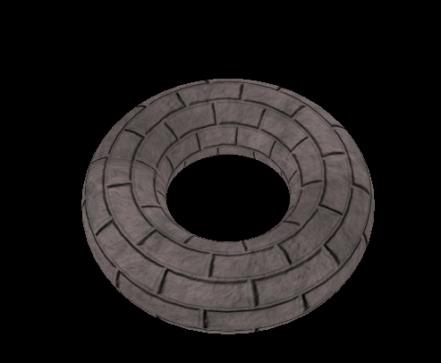

# OpenGL 纹理映射

OpenGL中纹理映射的实现包括以下几个关键步骤：

## 加载纹理

首先需要从文件中加载图片数据，可以使用像`stb_image`这样的库来加载图片。

## 创建和绑定纹理对象

在OpenGL中，你需要创建一个纹理对象，并将你的图片数据绑定到这个对象上。

## 设置纹理参数

这包括设置如何对纹理进行采样，比如纹理过滤（如线性过滤或者邻近过滤）和纹理包装（如重复或者镜像）。

## 将纹理应用到几何体

在着色器中，你会使用纹理坐标来决定3D对象的哪个部分对应纹理图像的哪个部分。

## 渲染

在渲染循环中，你将使用带有纹理的着色器来绘制对象，纹理将被应用到这些对象上。

# 计算机图形学中的纹理分类

在计算机图形学中，根据不同的标准和用途，纹理可以分为多种类型。以下是一些常见的纹理类型及其用途：

## 漫反射纹理 (Diffuse Textures)
- 用于模拟物体表面的基本颜色或图案。
- 影响物体的颜色，但不影响亮度或反光性。

## 镜面反射纹理 (Specular Textures)
- 模拟物体表面对光的反射特性。
- 确定物体表面哪些部分更加光滑和反光。

## 法线纹理 (Normal Maps)
- 通过改变光线方向来模拟物体表面细节，不改变表面结构。
- 用于增加视觉复杂度，而不增加几何细节。

## 高度纹理 / 置换纹理 (Height Maps / Displacement Maps)
- 模拟物体表面的实际凹凸变化。
- 置换纹理改变几何体表面，高度纹理用于视觉效果。

## 环境遮挡纹理 (Ambient Occlusion Maps)
- 模拟光线被物体微观结构遮挡的效果。
- 增加视觉深度和细节。

## 光照贴图 (Light Maps)
- 存储静态光照信息，如预计算光照下的阴影和亮区。
- 用于静态场景以提高渲染效率。

## 透明纹理 / Alpha Maps
- 创建透明效果或透明度变化区域。
- 允许某些部分透明，显示下面的内容。

## 粗糙度纹理 / 金属度纹理 (Roughness/Metalness Maps)
- 物理基础渲染（PBR）中模拟表面粗糙度和金属质感。
- 帮助创建真实的材料表现。

## 立方体纹理 / 天空盒 (Cube Maps / Skyboxes)
- 用于创建环境映射和全景背景。
- 模拟环境中的远景或反射。

这些纹理类型在3D渲染和游戏开发中有广泛的应用，选择哪种纹理取决于所需的视觉效果和渲染技术。
